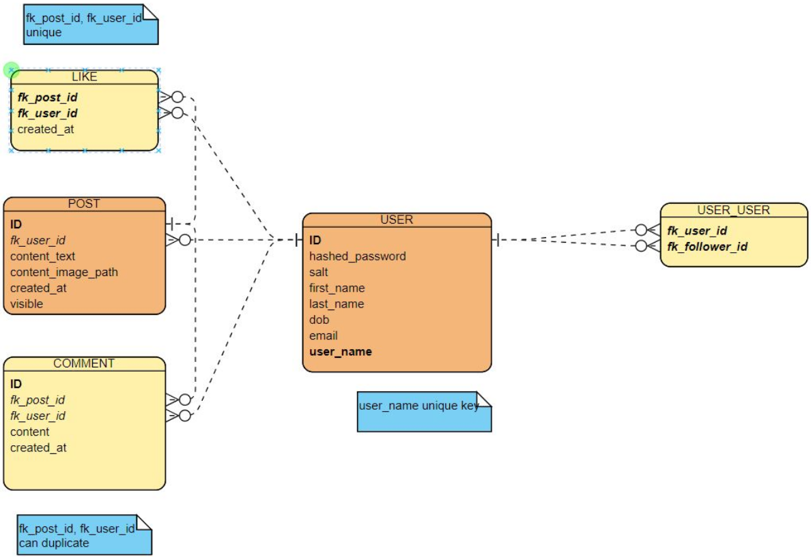
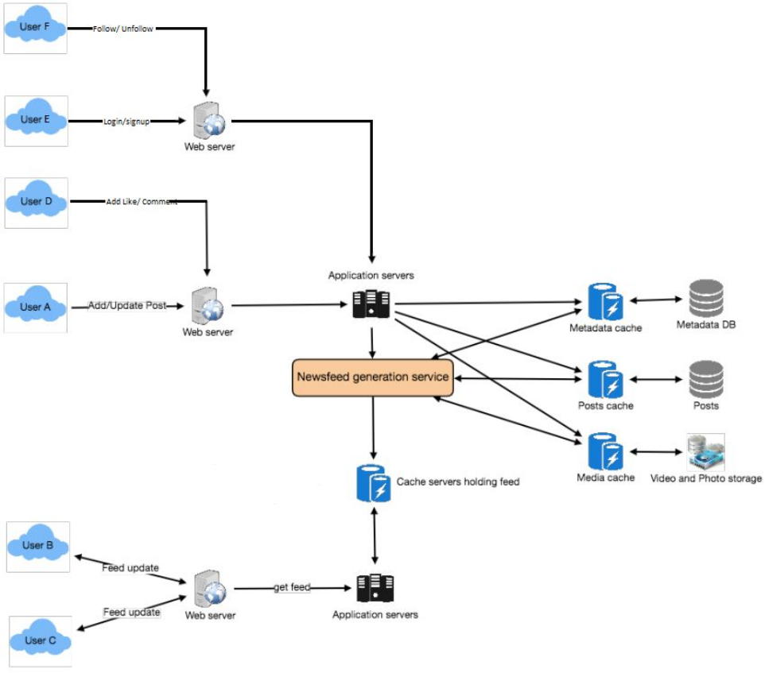

# Simple Golang Social Network Management Backend Service

This is a simple golang social network backend service designed in microservices. The front-end code can be found here: https://github.com/maxuanquang/social-network-fe

## I. System Requirement

***Design a simple social network like Facebook***

- This repository implements newsfeed and user's personal timeline for a simple social network.
- This social network allows users to write posts, give reactions and comments to posts, follow other users, see other users' timeline. All the changes of an user and who he is following can be seen on newsfeed.

## II. Requirements Clarifications

- The system just includes users (no *pages*, *groups*, etc.).
- Newsfeed is the homepage when logging in social network. Newsfeed includes changes (new posts, react to posts, follow other users, etc.) of an user and who he is following. All the posts are sorted based on recommendation or timeline.
- User's personal timeline is the page which includes that user's information and posts, the posts are sorted based on posted time.  
- Information about a post include the user who posted, post time, post contents (text, images, videos, sounds, etc.), reactions and comments that people interact on that post.
- Information about an user include name, a list of people who the user is following, a list of people following the user.
- Other needed features:
    - User can create account, can login, can follow or unfollow others, can edit personal information such as password and name.
    - User can interact with posts: like, comment.
    - User can see others' timeline.

## III. System Interface Definition

- Login: GET v1/users {user_name, password} {msg}
- Sign up: POST v1/users {user_name, email, first_name, last_name, birthday, password} {msg}
- Edit profile: PUT v1/users {first_name, last_name, birthday, password} {msg}
- See follow list: GET v1/friends/user_id {} {users}
- Follow: POST v1/friends/user_id {msg}
- Unfollow: DELETE v1/friends/user_id {msg}
- See user posts GET v1/friends/user_id/posts {posts}
- See post GET v1/posts/post_id {text, image, comments, likes}
- Create post POST v1/posts {text, image} {msg}
- Edit post PUT v1/posts/post_id {text, image} {msg}
- Delete post DELETE v1/posts/post_id {} {msg}
- Comment post POST v1/posts/post_id/comments {text} {msg}
- Like post POST v1/posts/post_id/likes {} {msg}
- Newsfeed GET v1/newsfeeds {posts}

## IV. Define Data Model

## V. High Level Design

## VI. How to Run
1. Start all services: `make compose_up_rebuild`
2. Migrate database: `make up_migration`
3. By default, the web server runs at: `localhost:19003`
## VII. TODO
- Set up Cloudfront CDN for S3 bucket
- Add Realtime Notifications Service
- Add Realtime Chat Service